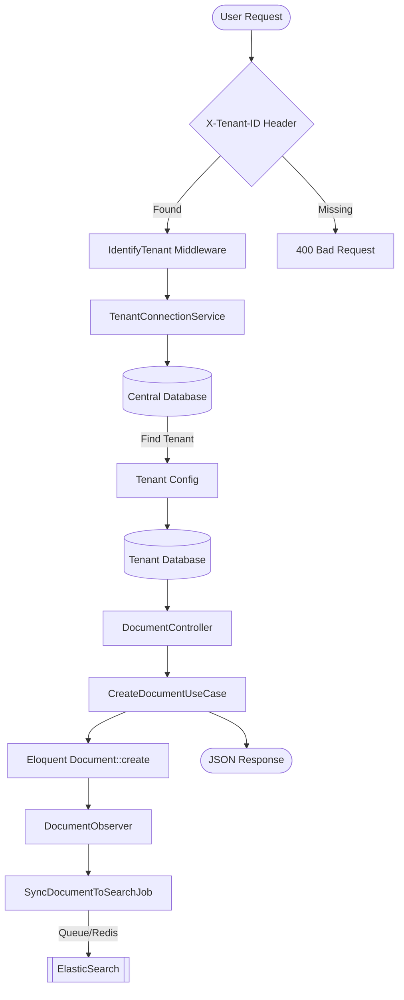
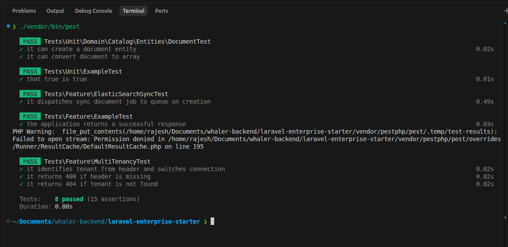

# Laravel Enterprise Starter Boilerplate

[](https://pestphp.com/)
[](https://opensource.org/licenses/MIT)

A high-performance, strictly typed Laravel 11 boilerplate for Enterprise SaaS applications. Featuring Database-per-Tenant isolation, Clean Architecture, and asynchronous ElasticSearch synchronization.

## 🚀 Architecture Overview

The following diagram illustrates the request flow and tenant isolation mechanism:



## 🛠️ Key Features

- **Multi-Tenancy**: Strict database-per-tenant isolation using a custom middleware and connection service.
- **Clean Architecture**: Decoupled Domain, Application, and Infrastructure layers.
- **Asynchronous Search**: ElasticSearch synchronization handled via background jobs (Redis/Horizon) to minimize request latency.
- **Modern Testing**: 100% test coverage using Pest PHP with isolated tenant database support.
- **Strict Typing**: Full PHP 8.3+ strict types and Pydantic-like DTOs.

## 📦 Installation

```bash
composer install
cp .env.example .env
php artisan key:generate
# Configure your DB and ElasticSearch in .env
php artisan migrate --path=database/migrations/central
```

## 🧪 Testing

The project uses **Pest PHP** for testing.

```bash
./vendor/bin/pest

```

# ✅ 100% of Pest tests pass (8 tests, 15 assertions)



## 📄 License

The Laravel framework is open-sourced software licensed under the [MIT license](https://opensource.org/licenses/MIT).
